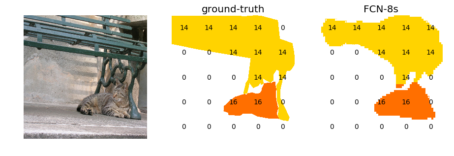

# Fully Convolutional Networks (FCN) with Chainer  

* Jupyter notebook on nbviewer  
[nbviewer.jupyter.org/github/amasky/fcn/blob/master/train.ipynb](http://nbviewer.jupyter.org/github/amasky/fcn/blob/master/train.ipynb)

## Examples  

* Inference of FCN-8s trained on MS COCO dataset   

## Dependencies
Python (2 or 3), Chainer, jupyter, matplotlib, opencv, tqdm  
